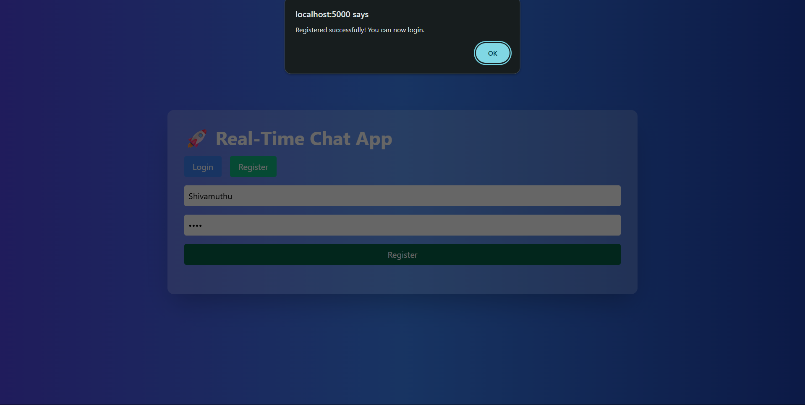
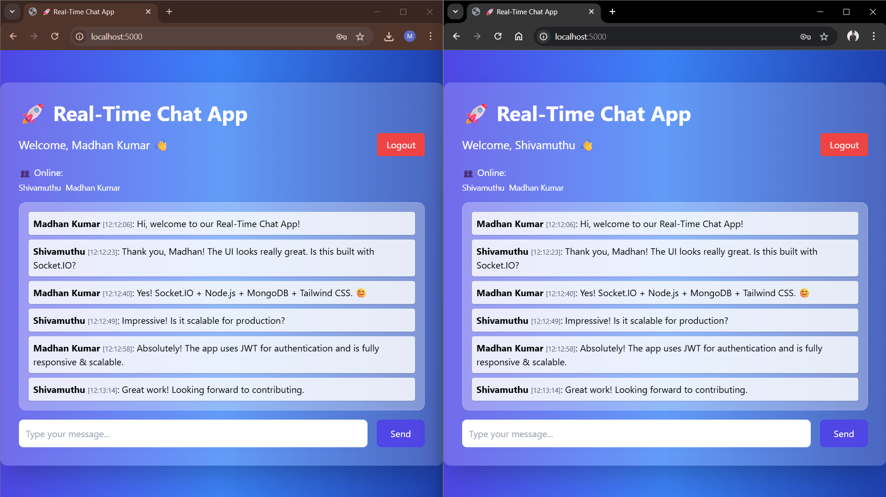

# Realtime-Chat-APP

# 🚀 Real-Time Chat App

A modern, secure, and responsive real-time chat platform — built using Node.js, Express, MongoDB, Socket.IO, and Tailwind CSS.

---

## 📸 Screenshots

### 📝 User Registration

### 💬 Chat Interface

---

## 🚀 Features

- 📝 User Registration & Login (JWT Auth)
- 💬 Real-time messaging with Socket.IO
- 👥 Online users list with live updates
- 🎨 Responsive and animated UI (Tailwind CSS + Animate.css)
- 🗄️ Chat history stored in MongoDB
- 🔐 Secure, scalable backend with Node.js & Express

---

## 💻 Tech Stack

- Node.js
- Express.js
- MongoDB
- Socket.IO
- Tailwind CSS
- Animate.css

---
